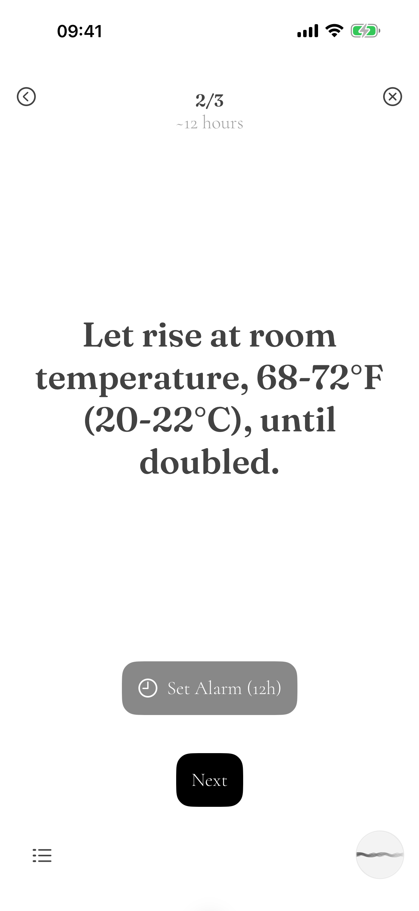

# Knead support — Jekyll site

## Run locally

```
bundle install
bundle exec jekyll serve
```

Then open http://localhost:4000.

## Structure

- `index.html` — front matter + the sequence of `` calls for each page section, in order. Reorder or drop a section by editing this list.
- `_layouts/default.html` — the shared `<head>` and page chrome (nav, `.shell` wrapper).
- `_includes/` — one file per visual section (`hero.html`, `schedule.html`, `guide.html`, `import.html`, `diary.html`, `download.html`, `help.html`), plus `nav.html` and `footer.html`. Prose and layout live here as plain HTML.
- `_data/` — the list-shaped content that each section loops over: `nav.yml`, `schedule.yml` (the timeline tracks), `import_steps.yml`, `help_checklist.yml`, `footer_links.yml`. Add, remove, or reorder items by editing these YAML files — no HTML editing required.
- `assets/` — app icon and screenshots (`.png`). Swap a file or its reference in the relevant include and nothing else moves.
- `assets/css/` — `styles.css` (design-system components — `.btn`, `.input`, `.nav`, `.card`, `.washed`; leave as-is when updating the system), `theme.css` (**all colors and fonts** — loaded after `styles.css`, so it wins; edit here to reskin), `site.css` (page layout and page-specific components).

## Swapping colors

Everything reads from custom properties in `assets/css/theme.css`. The two you'll change most:

```css
--color-accent:   #c67139;  /* terracotta */
--color-accent-2: #7a8a5e;  /* sage */
```

Each color role also has a 100–900 ramp (`--color-accent-300`, `--color-neutral-700`, …) — light steps for fills, 500 as base, dark steps for text on tints. If you change a base accent, retune its ramp so the tinted bands and label text stay legible. Page-level roles (`--band-sage`, `--panel`, `--kicker-ink`, `--time-hands-on`, `--device-shell`) are defined further down and just point at ramp steps — repoint them rather than editing the markup.

## Swapping screenshots

Frames are CSS; screenshots are ``. Replace the file (or the `src` in the relevant `_includes/*.html` file) and nothing else moves:

```html
<div class="device device--phone">
  
</div>
```

Variants: `.device--phone` (272px), `.device--phone-sm` (200px), `.device--phone-xs` (168px), `.device--tablet` (540px). Side buttons and corner radii are drawn in CSS, so use plain rectangular screenshots with no bezel baked in.

Override any single instance inline with `--device-width`, `--frame-pad`, `--frame-radius`. Frame colors (`--device-shell`, `--device-key`, `--device-edge`) live in `theme.css`.

## The support form

Static export, so the form in `_includes/help.html` posts via `mailto:`. Point `action` at your own endpoint when you have one.
